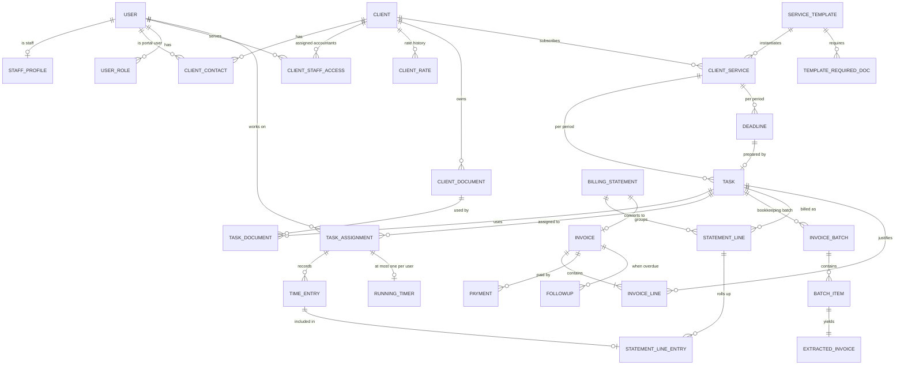

# AMC System — Development Plan & Architecture

Based on: SRS v1.2 (Active Management Consultancy), 2026-08-30
Prepared: 2026-09-12

---

## 1. Decisions at a glance

| Area | Decision | Why |
|---|---|---|
| Language | **TypeScript end-to-end** | One language for API, workers, PWA, shared contracts and infra. The UI is unavoidable and must be rich (timer, side-by-side PDF review, RTL dashboards), so React/TS is already required. |
| Backend | **NestJS** (Node 22) | Module system maps 1:1 to bounded contexts; DI makes ports/adapters natural; first-class BullMQ, Passport, validation. |
| Database | **PostgreSQL 16** via **Drizzle ORM** | Relational, strong constraints, JSONB for audit before/after, window functions for reports. Drizzle stays close to SQL and does not leak a generated client into the domain layer. |
| Jobs / scheduling | **BullMQ + Redis** | Per-file jobs for invoice batches (NFR-02 isolation), cron-style repeatable jobs for the deadline engine, escalations, recurrences, expiry alerts. |
| Frontend | **React 19 + Vite SPA (PWA)**, TanStack Router/Query, react-hook-form + Zod, shadcn/ui + Tailwind (logical properties for RTL), i18next, react-pdf | No SSR needed for an internal app; PWA + IndexedDB gives the offline-resilient timer (NFR-03). |
| Contracts | `packages/contracts` — Zod schemas shared by API and web | One source of truth for enums, states, DTOs; runtime validation both sides. |
| Auth | Own module: argon2id, DB-backed sessions with idle + absolute expiry, TOTP 2FA for Manager, RBAC + row-level scoping (assigned clients) | 10 users; keep vendor-free but behind an `AuthProvider` port so Cognito/Keycloak can replace it. |
| AI extraction | `InvoiceExtractor` port. First adapter: **Claude (vision on PDF pages, structured JSON output)**. Second adapter later if needed: Textract / Azure Document Intelligence | Swappable provider (NFR-06 privacy review), per-page cost tracking (FR-90). |
| Storage | S3 (SSE-KMS) via `FileStorage` port; MinIO locally | Encrypted at rest, versioned, lifecycle rules for backups. |
| Secrets vault (FR-05) | Envelope encryption: KMS master key → per-secret AES-256-GCM data key; every read writes an audit row in the same transaction | NFR-04/05. |
| Hosting | **AWS, region me-central-1 (UAE)** — start small: 1 × EC2/Lightsail with Docker Compose (api, worker, redis, caddy) + Postgres with nightly encrypted dumps + WAL to S3, S3 for documents, KMS, CloudWatch. Path to RDS/Fargate is config only | UAE data residency for financial data, fits SRS hosting budget, NFR-08/09. |
| Monorepo | pnpm workspaces + Turborepo, ESLint boundaries plugin (layer rules enforced by lint), Biome/Prettier, Vitest, Testcontainers, Playwright, GitHub Actions, Docker | Clean architecture only stays clean if the linter enforces it. |

---

## 2. Architecture: modular monolith, hexagonal inside each module

Scale is 10 users / 500 clients (NFR-09). Microservices would be a mistake. We build **one deployable** (two processes: `api` and `worker`) made of strictly separated modules.

```
amc/
├── apps/
│   ├── api/                 # NestJS HTTP entrypoint — wires modules, no business logic
│   ├── worker/              # NestJS BullMQ entrypoint — same modules, job processors
│   └── web/                 # React PWA
├── packages/
│   ├── contracts/           # Zod schemas + types shared API ↔ web
│   ├── kernel/              # Shared building blocks: Result, Money, Duration, DomainEvent,
│   │                        # AggregateRoot, Clock port, IdGenerator port, UnitOfWork port
│   └── modules/
│       ├── identity/        # users, roles, sessions, 2FA, permissions
│       ├── clients/         # leads, client file, rates + rate history, documents, vault, contact log
│       ├── services/        # service templates, tasks, state machine, assignment, recurrence, doc templates
│       ├── time-tracking/   # timer, time entries, idle detection, timesheets, locking
│       ├── billing/         # quotations, billing statements, invoices, pricing models
│       ├── deadlines/       # VAT/CT deadline rules, expiries, escalation chain, calendar
│       ├── invoice-processing/ # batches, extraction, ledger suggestion, checks, exceptions, approvals, export
│       ├── followups/       # AR list, message templates, follow-up log, supplier requests, statement compare
│       ├── bank-recon/      # statement import, matching, confidence, pending report
│       ├── reporting/       # read models: dashboard, hours, profitability, VAT report, cost dashboard (FR-90)
│       ├── integrations/    # adapters only: quickbooks, whatsapp, email, ai-extractor, s3, kms
│       ├── notifications/   # in-app + email/WhatsApp dispatch, user preferences
│       └── audit/           # append-only audit log, cross-cutting interceptor
└── infra/                   # docker-compose, Caddyfile, backup scripts, (later) CDK
```

Each module has the same four folders:

```
modules/billing/
├── domain/          # Entities, value objects, domain events, invariants. Pure TS. Zero imports
│                    # from Nest, Drizzle, Node APIs. Unit-tested in milliseconds.
├── application/     # Use cases (one class = one command/query), ports (interfaces) the
│                    # domain needs: repositories, Clock, EventBus, external systems. DTOs in/out.
├── infrastructure/  # Adapters: Drizzle repositories, mappers row ↔ entity, external clients.
└── http/            # Nest controllers, guards, request/response mapping to contracts.
```

### Hard rules (enforced by ESLint boundaries + dependency-cruiser in CI)

1. `domain` imports nothing outside itself and `kernel`.
2. `application` imports `domain` + `kernel` only. It depends on ports, never on adapters.
3. `infrastructure` and `http` depend inward; nothing depends on them except the app entrypoints.
4. A module never imports another module's `domain` or touches its tables. Cross-module needs go through the other module's **public application API** (exported facade) or **domain events** delivered via an **outbox table** (transactional, at-least-once).
5. No floats for money or time. `Money` = integer fils + currency code. `Duration` = integer seconds. `Rate` = Money per hour. Rounding happens in one place, documented.
6. Every state machine (Lead, Task, Quotation, Invoice, BatchItem, FollowUp) is an explicit transition table in `domain`; illegal transitions return a typed error, never throw generic exceptions.
7. Every write use case runs inside a `UnitOfWork`; audit rows (FR-57, NFR-05) are written in the same transaction as the change. The DB role used by the app has **no UPDATE/DELETE grant** on `audit_log`.
8. Time is stored UTC; business rules use `Asia/Dubai` via the `Clock` port so deadline logic is testable with a fake clock.
9. Reads for dashboards/reports (FR-35, FR-80–82) are plain SQL queries in `reporting` against views — CQRS-lite, no event sourcing.
10. Public contracts (`packages/contracts`) are versioned with the API; the web app never types a DTO by hand.

### Key ports (interfaces) and their first adapters

| Port | First adapter | Notes |
|---|---|---|
| `FileStorage` | S3 (MinIO in dev) | Presigned uploads for 200-file batches (FR-50). |
| `InvoiceExtractor` | Claude vision + JSON schema | Returns 15 fields + per-field confidence + page count for cost. |
| `LedgerSuggester` | Rules → QuickBooks CoA → supplier history | Ordered strategy chain (FR-52). |
| `AccountingSystem` | QuickBooks Online API | OAuth2 token store encrypted in vault. Phase 7. |
| `Messenger` | Email (SES) first; WhatsApp Cloud API later (FR-65) | Templates staged by debt age. |
| `SecretVault` | KMS envelope encryption | Access events → audit. |
| `Clock`, `IdGenerator` | System / ULID | Faked in tests. |
| `EventBus` | In-process + outbox | Worker drains outbox. |

### Cross-cutting behaviours built in Phase 0 (not retrofitted)

- **Audit log** (NFR-05): interceptor + unit-of-work hook; before/after JSONB; actor, IP, request id.
- **RBAC + scoping** (2.2): Manager / Accountant / Data entry / Client. Accountant sees assigned clients only — enforced in repositories, not just in the UI.
- **i18n + RTL**: every string keyed; `dir` switches per user; numbers/dates via `Intl` with Arabic and English locales.
- **Observability**: structured logs (pino), request ids, health endpoints, error tracking (Sentry self-hosted or SaaS), CloudWatch alarms.
- **Backups** (NFR-08): nightly `pg_dump` encrypted to S3 + continuous WAL archiving; a monthly scripted restore test in CI.

---

## 3. Data model — ERD v2

Revised after review on 2026-09-14. Four structural rules now drive the model:

1. **The task is the hub between a client and their documents.** A task reaches exactly the documents that belong to its own client, never the whole repository.
2. **Staff attach to tasks, not to timers.** The timer records against the task; who worked is resolved through the task's assignment.
3. **One `users` table for every person who logs in**, staff and client contacts alike, discriminated by roles rather than a type column.
4. **No invoice line exists without a task.** Billing is impossible until work exists.

### 3.1 The spine

```
client ──< client_service ──< task ──< task_documents >── client_document
                               │
                               ├──< task_assignment (staff) ──< time_entry
                               │
                               ├──< invoice_line >── invoice
                               │
                               ├──< invoice_batch (AI bookkeeping)
                               │
                               └──  deadline (1:1 per period)
```

Everything billable, every document in play, and every recorded hour is reachable from a task. That single rule is what makes a client statement defensible.



### 3.2 People: one `users` table, two kinds of party

`users` holds every person who can log in: manager, accountants, data entry, and later the client portal contacts. Discrimination is by role, not by a type column, because the SRS already defines four roles with different permissions and roles are what the guards read anyway.

| Table | Purpose |
|---|---|
| `users` | email, password_hash (argon2id), status, locale, totp_secret, last_login_at |
| `roles`, `permissions`, `user_roles` | Manager / Accountant / DataEntry / ClientPortal |
| `staff_profiles` | user_id PK, employee code, working hours and timezone (drives FR-25 idle and after-hours detection), default cost rate, active |
| `client_contacts` | client_id, user_id (null until the portal phase), name, phone, email, is_primary |
| `client_staff_access` | client_id, user_id — the row-level scoping that limits an accountant to assigned clients |

One refinement worth stating plainly: **the client organisation is not a user.** The Trade Registration Number, tax period, hourly rate and invoices belong to a company, while a login belongs to a person. So `clients` stays its own entity and a portal login is a `client_contact` pointing at a `users` row. A sole trader simply has one contact. Merging the two would force every invoice to hang off a person and break as soon as a client has two contacts.

### 3.3 Documents reached through the task

| Table | Notes |
|---|---|
| `document_types` | trade licence, Emirates ID, passport, VAT certificate…; `has_expiry` flag |
| `client_documents` | client_id, document_type_id, storage_key, issued_at, expires_at, status (required / received / expired / renewing). The client owns the document (FR-04) |
| `task_documents` | **task_id, client_document_id, template_requirement_id (nullable), role (input / output / evidence), attached_by, attached_at.** UNIQUE(task_id, client_document_id) |
| `generated_documents` | FR-15 letters and declarations, linked to task_id and client_id |

The task's checklist comes from `template_required_documents`; each requirement is satisfied by attaching one of that client's documents through `task_documents`. The gate in FR-12, no move to "in progress" before mandatory documents are present, is a query over that join and nothing else. A document renewed once is reused by every later task without being re-uploaded.

Integrity rule: a `task_documents` row is only valid when the document's client matches the task's client. Enforced by a composite foreign key, not a trigger — `client_documents` carries UNIQUE(id, client_id), and `task_documents` holds `client_id` referencing `(client_document_id, client_id)` and `(task_id, client_id)` together. Cross-client leakage becomes impossible at the database level.

### 3.4 Staff on tasks, timer on the task

| Table | Notes |
|---|---|
| `task_assignments` | task_id, user_id, role (responsible / collaborator), assigned_at, unassigned_at, assigned_by. **Append-only history** — reassignment closes one row and opens the next (FR-13) |
| `running_timer` | user_id PK, task_assignment_id, started_at, device_id, last_heartbeat_at |
| `time_entries` | **task_assignment_id NOT NULL**, started_at, ended_at, duration_seconds (generated), source (timer / manual), manual_reason, billable, approved_at, approved_by, statement_line_entry back-reference |
| `timer_events` | append-only start / stop / heartbeat stream from the device, for NFR-03 recovery |

A time entry carries no client column and no staff column. Both are reached through `task_assignment → task → client_service → client`. A reporting view, `v_time_entries_resolved`, exposes client_id, user_id and task_id so that hour reports and timesheets stay one-line queries.

Why the entry points at the *assignment* rather than the task directly: if it pointed at the task alone, reassigning a task would silently re-attribute last month's hours to the new accountant, and two people working the same task would be indistinguishable. Because assignments are append-only, the assignment row is a permanent record of "this person, on this task, during this period". Staff is still not duplicated onto the time record, and FR-31's breakdown by staff member and FR-24's per-person timesheet both survive reassignment intact.

FR-21, one active timer per staff member, is a per-person constraint by its own wording, so `running_timer` is keyed by user_id. That is a lock table holding at most one row per person, not a history table. Starting a timer stops the previous one in the same transaction and writes the finished `time_entry`, which links only to the assignment.

FR-20 still holds: client, task and staff are all mandatory and all derivable, so no unattributed time can exist.

### 3.5 Services, tasks, deadlines

| Table | Notes |
|---|---|
| `service_templates` | the eleven services, code, name_ar / name_en, deadline_rule_id, default pricing model |
| `template_steps`, `template_required_documents` | steps and the document checklist, with a `mandatory` flag |
| `client_services` | client_id, service_template_id, pricing model, rate override, tax period (start month + length), active_from / active_to |
| `tasks` | client_service_id, client_id, state, period_key, due_at, assignee resolved via assignments, completed_at, billable_from |
| `task_steps`, `task_state_transitions` | checklist progress and an explicit record of every state move |
| `deadline_rules` | basis: period_end + N days, or fiscal_year_end + 9 months; weekend and holiday handling |
| `deadlines` | client_service_id, period_key, due_at, task_id, status |
| `business_holidays` | UAE calendar, so a 28th falling on a weekend or public holiday shifts to the next business day |
| `escalations` | deadline_id or task_id, stage (7 days client / 14 days accountant / 5 days manager), fired_at |

`tasks` carries `client_id` even though it is reachable through `client_service`. That is deliberate: scoping queries and document access hit it constantly. It cannot drift, because `client_services` carries UNIQUE(id, client_id) and `tasks` holds a composite foreign key on `(client_service_id, client_id)`.

Idempotency for recurrence: UNIQUE(client_service_id, period_key) on both `tasks` and `deadlines`. The scheduler can run twice, or be replayed after an outage, without creating duplicates.

### 3.6 Billing anchored to tasks

| Table | Notes |
|---|---|
| `quotations`, `quotation_lines` | may exist before any task — a quote is a promise, not billing (FR-30) |
| `billing_statements` | client_id, period, state (draft / reviewed / issued) |
| `statement_lines` | statement_id, **task_id NOT NULL**, hours, rate, amount, excluded flag, adjustment and reason |
| `statement_line_entries` | statement_line_id, time_entry_id — exactly which hours rolled into the line |
| `invoices` | client_id, number, issued_at, due_at, state, totals, statement_id (nullable) |
| `invoice_lines` | invoice_id, **task_id NOT NULL**, line_type (hourly / fixed_fee / retainer / recharge), quantity, unit_rate, amount |
| `payments` | invoice_id, amount, paid_at, method |
| `ai_usage` | batch_id, client_id, pages, unit_cost, total_cost — rechargeable per client (FR-90) |

`invoice_lines.task_id` is NOT NULL, so an invoice cannot exist without work behind it. The billing use case additionally refuses a task that is not in a billable state, and `tasks.billable_from` marks when that opened. Which states qualify is configuration, because monthly accounting bills at period close while a one-off registration bills on completion.

Two consequences you should decide on deliberately:

- **A pure advance payment or deposit has no task**, so under this rule it cannot be invoiced. If the firm ever needs one, the clean answer is a lightweight task of type `advance` on the client's service, not a nullable task_id. Keeping the column NOT NULL is the stronger position and I recommend holding it.
- **FR-34 is unaffected.** Work may still start before payment; the invoice simply shows as collection pending.

Locking (FR-26) comes from the join: a `time_entry` referenced by a `statement_line_entry` whose statement has been issued is read-only. Unlinking is a Manager action that writes to the audit log.

### 3.7 AI bookkeeping, follow-ups, reconciliation, audit

`invoice_batches` links to a **task**, normally that client's monthly accounting task for the period. That keeps the same rule everywhere: the uploaded PDFs, the extracted entries, the export and the AI page cost all hang off the task they were done for, so the work is traceable and billable.

| Table | Notes |
|---|---|
| `invoice_batches`, `batch_items`, `extracted_invoices` | batch → task; item status, page_count, confidence, exception_reasons[]; the 15 extracted fields |
| `suppliers`, `chart_of_accounts`, `ledger_rules`, `supplier_account_memory` | the ordered suggestion chain for FR-52 |
| `item_approvals` | batch_item_id, approved_by, approved_at, before / after JSONB (FR-57) |
| `followups`, `message_templates` | invoice_id, stage by debt age, channel, locale, sent_at, reply_at, owner |
| `supplier_requests`, `supplier_statements`, `statement_comparison_lines` | FR-63 and FR-64 |
| `bank_statements`, `bank_transactions`, `match_suggestions`, `matches` | FR-70 to FR-72 |
| `audit_log` | append-only, actor, action, entity, before / after JSONB, ip, request_id. No UPDATE or DELETE grant |
| `outbox` | domain events, drained by the worker |

### 3.8 Money, time, and keys

Money is an integer count of fils with a currency code; durations are integer seconds; rates are money per hour. No floating point anywhere in the billing path. Timestamps are stored in UTC and business rules read `Asia/Dubai` through the `Clock` port. Primary keys are ULIDs, so records sort by creation time and can be generated before insert.

---

## 4. Phase plan

We follow the SRS phases exactly so each phase closes with its acceptance test from SRS §8. Estimates assume you + Claude working steadily; they are planning numbers, not promises.

| Phase | Scope (FR) | Deliverable / acceptance | Est. |
|---|---|---|---|
| **P0 Foundation** | Monorepo, kernel, identity (login, roles, sessions, 2FA), audit log, i18n/RTL shell, CI, Docker, backups, ADRs | Login works in Arabic and English, roles enforced, every write audited, restore test passes | 1–2 wks |
| **P1 Clients, Tasks, Timer, Deadlines** | FR-01…06, FR-10…15, FR-20…26, FR-40…44 | SRS P1: real client registered, tasks auto-created from templates, timer works on phone + desktop (offline-safe), next VAT deadline correct per client | 4–5 wks |
| **P2 Billing** | FR-30…36 | SRS P2: monthly statement = hours × rate, review, one-click invoice, figures match manual calc; entries lock | 2–3 wks |
| **P3 AI invoice pipeline** | FR-50…56, FR-59, NFR-01/02 | SRS P3: 50 real PDFs → correct Excel, ≥ 90% fields right, every error lands in exceptions | 3–4 wks |
| **P4 Approval & audit hardening** | FR-57, FR-58, NFR-05 (mostly already built in P0/P3) | SRS P4: nothing unapproved can be exported; before/after visible in audit | 1 wk |
| **P5 Follow-ups** | FR-60…65 | SRS P5: AR list matches reality, staged messages from templates, replies logged; email live, WhatsApp when approved | 2 wks |
| **P6 Bank reconciliation** | FR-70…72 | SRS P6: real statement imported, ≥ 80% auto-matched | 2 wks |
| **P7 QuickBooks** | FR-56 (API), FR-52 CoA import | SRS P7: approved entry reaches QuickBooks with right account and tax | 2 wks |
| Continuous | FR-80…83 dashboard/reports/VAT, FR-90 cost dashboard | Grown each phase as data appears | — |

Total: roughly 4–5 months of steady work.

### Phase 0 task list (what we do first, in order)

1. `git init`, pnpm workspace, Turborepo, TS strict config, Biome, ESLint boundaries rules.
2. `packages/kernel`: `Result`, `Money`, `Duration`, `DomainEvent`, `AggregateRoot`, `Clock`, `IdGenerator`, `UnitOfWork`.
3. `apps/api` skeleton, config validation (Zod on env), health endpoints, pino logging.
4. Postgres + Drizzle migrations pipeline; Testcontainers integration test harness.
5. `modules/identity`: users, roles, sessions, login, TOTP, guards, scoping helper.
6. `modules/audit`: append-only table, DB grants, interceptor, unit-of-work hook, read API for Manager.
7. `apps/web` skeleton: routing, auth flow, i18n (ar/en), RTL layout, shadcn base, PWA manifest.
8. `infra/`: docker-compose (dev + prod), Caddy TLS, backup script + restore script, GitHub Actions (lint, typecheck, test, build, image push).
9. `docs/adr/` with ADR-001 stack, ADR-002 modular monolith, ADR-003 money/time precision, ADR-004 audit strategy, ADR-005 hosting.

---

## 5. Senior notes and risks to handle early

- **Audit and roles are Phase 0, not Phase 4.** Retrofitting audit into a finance system is the most expensive mistake available here.
- **VAT deadline rule (FR-40)**: 28th of the month following period end, but when it falls on a weekend or UAE public holiday the FTA moves it to the next business day. Implement a configurable holiday calendar from day one.
- **CT return**: due 9 months after the end of the company's tax period. Model tax periods per client explicitly (start month + length).
- **Idempotency of recurrence and deadlines**: natural keys per (client service, period). The scheduler can run twice safely.
- **AI accuracy**: build the golden set of 50 real invoices before writing the extractor. Measure field-level accuracy every run. Confidence = model self-report combined with deterministic checks (arithmetic, VAT rate sanity, duplicate detection); do not trust a single number.
- **Cost per page** (FR-90) is recorded per batch item so it can be re-billed per client, as the SRS suggests.
- **Timer resilience (NFR-03)**: timer events are appended locally (IndexedDB) with device timestamps, synced when online; the server reconciles and asks the user to confirm gaps rather than guessing.
- **WhatsApp Business API** approval takes weeks. Apply during P1; email + copy-to-clipboard templates are the fallback until then.
- **QuickBooks sandbox** should be connected during P3 (chart of accounts import, FR-52) even though posting is P7.
- **Client portal (role C)**: tenancy and scoping are designed now so it is an additive module later, not a rewrite.
- **Data residency**: keep everything in me-central-1. If Claude on Amazon Bedrock is available in the region at build time, prefer it over the public API for the extractor; otherwise the direct Anthropic API is acceptable under NFR-06 (API data is not used for training) after your privacy review.

---

## 6. Hosting on AWS: recommendation

**Yes to AWS, for one decisive reason: the UAE region (me-central-1).** Your clients' financial and tax data stays in-country, which is the strongest answer you can give a client asking where their data lives.

Start with the smallest setup that still meets NFR-04/08/09:

| Component | Service | Approx. monthly |
|---|---|---|
| App + worker + Redis + reverse proxy | 1 × EC2 t4g.small (or Lightsail 2 GB), Docker Compose, Caddy TLS | USD 15–25 |
| Database | Postgres in Docker on the same host, nightly encrypted dump + WAL to S3 | 0 (included) |
| Documents + backups | S3, SSE-KMS, versioning, lifecycle to Glacier | USD 3–10 |
| Vault master key | KMS | USD 1–2 |
| Email | SES | ~0 |
| Logs / alarms | CloudWatch | USD 2–5 |
| **Total** | | **≈ USD 25–45 (≈ AED 90–165)** |

That matches the SRS hosting line (AED 40–150 + storage AED 20–75). When the firm grows or wants managed HA, move Postgres to RDS and the containers to ECS Fargate; because the app is 12-factor and containerised, that is a config and infra change, not a code change.

What to avoid: Kubernetes, microservices, multi-AZ everything on day one. Ten users do not need it, and every extra managed service in me-central-1 costs more than in US regions.

---

## 7. How we work together

- One repo, trunk-based, short branches, PR per unit of work, CI green before merge.
- Every architectural choice gets an ADR in `docs/adr/`.
- Each FR maps to: domain rule + use case + test named after the FR (e.g. `FR-21.spec.ts`).
- Each phase ends by running the SRS §8 acceptance script with real data.
- Definition of done per use case: domain tests, use-case tests with fake ports, one integration test, UI wired, audit verified, i18n keys in both languages.
